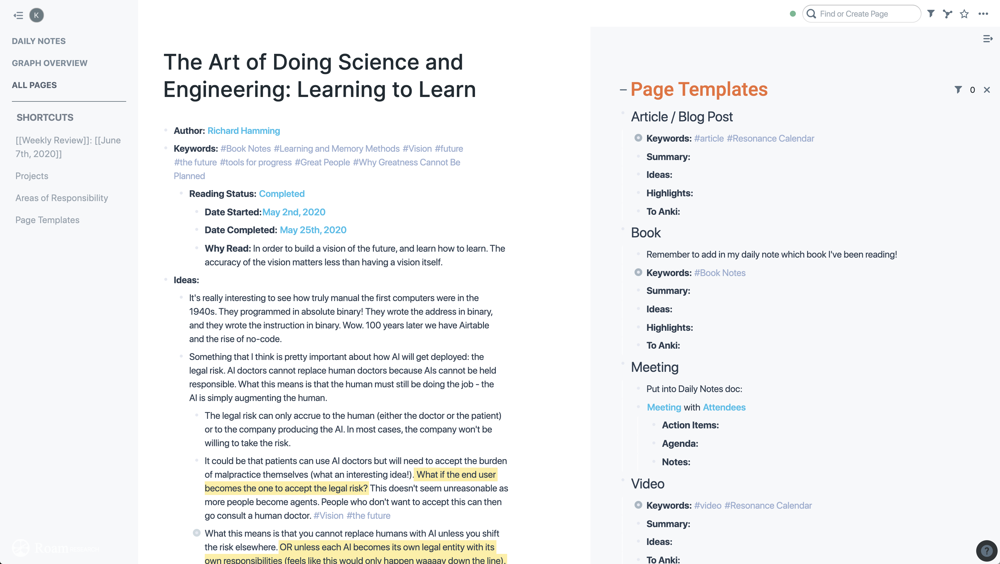

# roam-beautified
CSS for beautifying Roam Research (roamresearch.com).

## Instructions:
1. Download Stylus: https://chrome.google.com/webstore/detail/stylus/clngdbkpkpeebahjckkjfobafhncgmne?hl=en
2. Install the SF Pro Display and Inter fonts.
3. Copy the roam-beautified.css text into Stylus
4. In Stylus, at the bottom of the page where it says "Applies to", set it up to say "Applies to URLs starting with https://roamresearch.com/#/"

## Credits:
Adapted from a combination of Maggie Appleton (https://maggieappleton.com/paintingroam) and Taylor Rogalski's Roam CSS.
